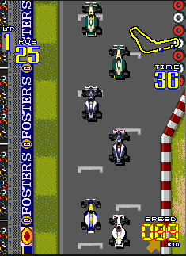

Multithreaded Grand Prix Simulator
==================================

Implement a multithreaded grand prix simulator where every car will be an independent entity.
You  will be simulating an N laps race.

Technical Requirements
----------------------
- The race's lap can be static or automatically generated.
- Racers number can be configured on start.
- Define a random max speed for each car.
- You will emulate the increasing speed behaviour that any car has.
- If a car detect another car on his route and it's slower, it must slow down its speed or try to rebase it.
- Each racer behaviour will be implemented as a separated thread.
- Cars threads must use the same map or city layout data structure resource.
- Define how many laps before starting the race.
- Display each car's speed, position, racing time and lap.
- At the end, display the top 3 winners.

General Requirements
--------------------
- Source code must be hosted in the class `ap-labs` repository.
- Make sure that you complete the below defined deliverables.
- Source code dependencies must be clearly documented.

Deliverables
------------
- Source code in each team's member repository (`ap-labs/challenges/grand-prix`).
- Architecture Document - [ARCHITECTURE.md](ARCHITECTURE.md)
- Build/Run automation (`Makefile` and documentation - [GRAND_PRIX.md](GRAND_PRIX.md))
- Project's presentation (5-10 minutes)

Permitted programming languages
-------------------------------
- Multithreaded core backend
  - C
  - Go
- User Interface (optional)
  - Any
  - If it's terminal, output must be human-readable

Submission Details
------------------
- Read [Classify API](../../classify.md)

Grading Policy
--------------
| Concept                      | Grade |
|------------------------------|-------|
| Architecture Document        | 20%   |
| Multithreaded implementation | 30%   |
| Build Automation             | 20%   |
| Coding best practices        | 10%   |
| Presentation                 | 20%   |
| TOTAL                        | 100%  |

- **Free Lab Bonus**

  You can get an extra bonus if you implement an intelligent mechanism to avoid being overrun when
  a racer tries to pass another racer.