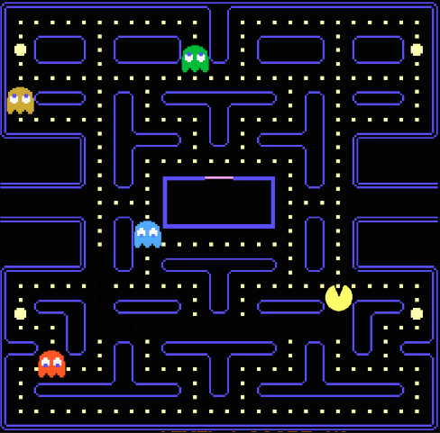

Multithreaded Pacman Game
=========================

Implement a multithreaded version of the arcade video game [Pacman](https://en.wikipedia.org/wiki/Pac-Man). This version will be a
Computer vs Human game. Each enemy will be independent and the number of enemies is configurable. Below you can see the general
requirements for the enemies and human player (pacman) interation.

Technical Requirements
----------------------
- The game's maze layout can be static.
- The `pacman` gamer must be controlled by the user.
- Enemies are autonomous entities that will move a random way.
- Enemies and pacman should respect the layout limits and walls.
- Enemies number can be configured on game's start.
- Each enemy's behaviour will be implemented as a separated thread.
- Enemies and pacman threads must use the same map or game layout data structure resource.
- Display obtained pacman's scores.
- Pacman loses when an enemy touches it.
- Pacman wins the game when it has taken all coins in the map.

General Requirements
--------------------
- Source code must be hosted in the class `ap-labs` repository.
- Make sure that you complete the below defined deliverables.
- Source code dependencies must be clearly documented.

Deliverables
------------
- Source code in each team's member repository (`ap-labs/challenges/pacman`).
- Architecture Document - [ARCHITECTURE.md](ARCHITECTURE.md)
- Build/Run automation (`Makefile` and documentation - [PACMAN.md](PACMAN.md))
- Project's presentation (5-10 minutes)

Permitted programming languages
-------------------------------
- Multithreaded core backend
  - C
  - Go
- User Interface (optional)
  - Any
  - If it's terminal, output must be human-readable

Submission Details
------------------
- Read [Classify API](../../classify.md)

Grading Policy
--------------
| Concept                      | Grade |
|------------------------------|-------|
| Architecture Document        | 20%   |
| Multithreaded implementation | 30%   |
| Build Automation             | 20%   |
| Coding best practices        | 10%   |
| Presentation                 | 20%   |
| TOTAL                        | 100%  |

- **Free Lab Bonus**

  You get cat an extra bonus if you implement an Artificial Intelligence algorithm in enemies behaviour
  for finding the pacman location, trace the route and follow it.