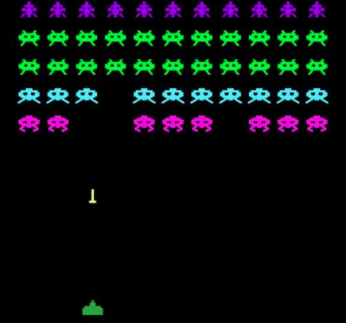

Multithreaded Space Invaders Game
=================================

Implement a multithreaded version of the arcade video game [Space Invaders](https://en.wikipedia.org/wiki/Space_Invaders). This version will be a
Computer vs Human game. Each enemy (space invader) will be independent and the number of enemies is configurable. Below you can see the general
requirements for the space invaders and main shooter interaction.

Technical Requirements
----------------------
- The game's layout can be static.
- The shooter must be controlled by the user.
- Space Invaders are autonomous entities that will move and shoot in a random way.
- Space Invaders and shooter should respect the layout limits.
- Space Invaders number can be configured on game's start.
- Each invader's behaviour will be implemented as a separated thread.
- Space Invaders and main shooter threads must use the same map or game layout data structure resource.
- Display obtained shooter's scores.
- Main Shooter loses when it has been shooted 10 times.
- Main Shooter wins the game when it has taken down its enemies in the map.

General Requirements
--------------------
- Source code must be hosted in the class `ap-labs` repository.
- Make sure that you complete the below defined deliverables.
- Source code dependencies must be clearly documented.

Deliverables
------------
- Source code in each team's member repository (`ap-labs/challenges/space-invaders`).
- Architecture Document - [ARCHITECTURE.md](ARCHITECTURE.md)
- Build/Run automation (`Makefile` and documentation - [SPACE_INVADERS.md](SPACE_INVADERS.md))
- Project's presentation (5-10 minutes)

Permitted programming languages
-------------------------------
- Multithreaded core backend
  - C
  - Go
- User Interface (optional)
  - Any
  - If it's terminal, output must be human-readable

Submission Details
------------------
- Read [Classify API](../../classify.md)

Grading Policy
--------------
| Concept                      | Grade |
|------------------------------|-------|
| Architecture Document        | 20%   |
| Multithreaded implementation | 30%   |
| Build Automation             | 20%   |
| Coding best practices        | 10%   |
| Presentation                 | 20%   |
| TOTAL                        | 100%  |

- **Free Lab Bonus**

  You can get an extra bonus if you implement an Artificial Intelligence algorithm in space invaders behaviour
  for finding the main shooter location, trace the route and follow it.
